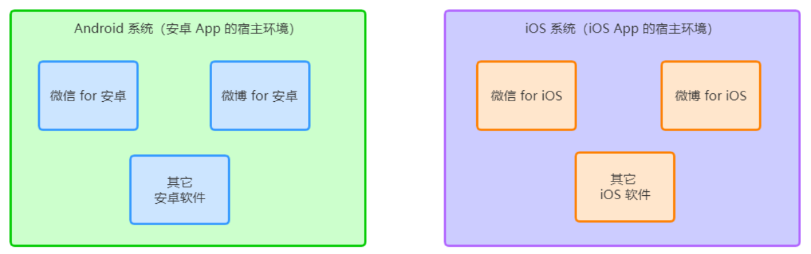
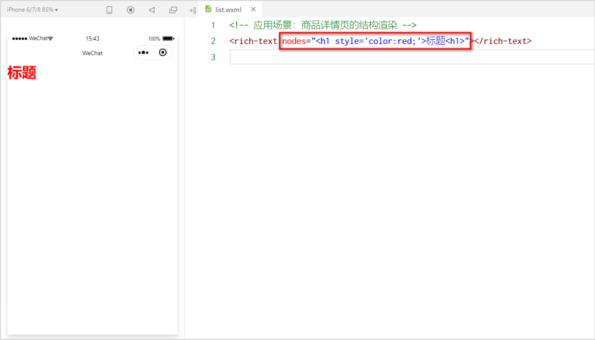
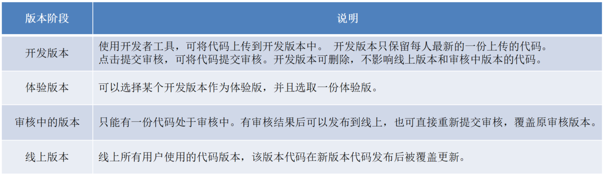

# 一. 起步 <!-- omit from toc -->

> https://www.bilibili.com/video/BV1834y1676P/?

- [1. 项目结构](#1-项目结构)
  - [1.1. JSON 配置文件](#11-json-配置文件)
    - [1.1.1. app.json 文件](#111-appjson-文件)
    - [1.1.2. project.config.json 文件](#112-projectconfigjson-文件)
    - [1.1.3. sitemap.json 文件](#113-sitemapjson-文件)
    - [1.1.4. 页面的 .json 配置文件](#114-页面的-json-配置文件)
  - [1.2. WXML 模板](#12-wxml-模板)
  - [1.3. WXSS 样式](#13-wxss-样式)
  - [1.4. JS 逻辑交互](#14-js-逻辑交互)
- [2. 小程序宿主环境](#2-小程序宿主环境)
  - [2.1. 简介](#21-简介)
  - [2.2. 通信模型](#22-通信模型)
  - [2.3. 运行机制](#23-运行机制)
  - [2.4. 组件](#24-组件)
    - [2.4.1. 组件的分类](#241-组件的分类)
    - [2.4.2. 常用的视图容器类组件](#242-常用的视图容器类组件)
    - [2.4.3.  常用的基础内容组件](#243--常用的基础内容组件)
    - [2.4.4.  其它常用组件](#244--其它常用组件)
  - [2.5. API](#25-api)
- [3. 协同工作和发布](#3-协同工作和发布)
  - [3.1. 协同工作](#31-协同工作)
  - [3.2. 成员管理](#32-成员管理)
  - [3.3. 小程序的版本](#33-小程序的版本)
  - [3.4. 发布上线](#34-发布上线)
  - [3.5. 运营数据](#35-运营数据)


# 1. 项目结构


- pages 用来存放所有小程序的页面

- utils 用来存放工具性质的模块（例如：格式化时间的自定义模块）

- app.js 小程序项目的入口文件

- app.json 小程序项目的全局配置文件

- app.wxss 小程序项目的全局样式文件

- project.config.json 项目的配置文件

- sitemap.json 用来配置小程序及其页面是否允许被微信索引

  

每个页面由 4 个基本文件组成：

- .js 文件（页面的脚本文件，存放页面的数据、事件处理函数等）
- .json 文件（当前页面的配置文件，配置窗口的外观、表现等）
- .wxml 文件（页面的模板结构文件）
- .wxss 文件（当前页面的样式表文件）


## 1.1. JSON 配置文件

小程序项目中有 4 种 json 配置文件：

1. 项目根目录中的 app.json 配置文件
2. 项目根目录中的 project.config.json 配置文件
3. 项目根目录中的 sitemap.json 配置文件
4. 每个页面文件夹中的 .json 配置文件


### 1.1.1. app.json 文件

app.json 是当前小程序的全局配置，包括了小程序的所有页面路径、窗口外观、界面表现、底部 tab 等。


简单了解下这 4 个配置项的作用：

1. pages：用来记录当前小程序所有页面的路径
2. window：全局定义小程序所有页面的背景色、文字颜色等
3. style：全局定义小程序组件所使用的样式版本
4. sitemapLocation：用来指明 sitemap.json 的位置


新建一个页面：


调整页面顺序：


### 1.1.2. project.config.json 文件

project.config.json 是项目配置文件，用来记录我们对小程序开发工具所做的个性化配置，例如：

- setting 中保存了编译相关的配置
- projectname 中保存的是项目名称
- appid 中保存的是小程序的账号 ID

settings 的内容体现在：


### 1.1.3. sitemap.json 文件

- sitemap.json 文件用来配置小程序页面是否允许微信索引。

- 当开发者允许微信索引时，微信会通过爬虫的形式，为小程序的页面内容建立索引。当用户的搜索关键字和页面的索引匹配成功的时候，小程序的页面将可能展示在搜索结果中


> 注意：sitemap 的索引提示是默认开启的，如需要关闭 sitemap 的索引提示，可在小程序项目配置文件 project.config.json 的 setting 中配置字段 checkSiteMap 为 false


### 1.1.4. 页面的 .json 配置文件

和全局的app.json差不多，优先级更高。


## 1.2. WXML 模板

WXML（WeiXin Markup Language）是小程序框架设计的一套标签语言，用来构建小程序页面的结构，类似网页开发中的 **HTML**。

**WXML 和 HTML 的区别：**

1. 标签名称不同

   - HTML （div, span, img, a）

   - WXML（view, text, image, navigator）

2. 属性节点不同

   - HTML: \<a <font color='red'>href</font> ="#">超链接</a>

   - WXML: <navigator <font color='red'>url</font> ="/pages/home/home"></navigator>

3. 提供了类似于 Vue 中的模板语法

   - 数据绑定

   - 列表渲染

   - 条件渲染


## 1.3. WXSS 样式

WXSS (WeiXin Style Sheets)是一套样式语言，用于描述 WXML 的组件样式，类似于网页开发中的 **CSS**。

**WXSS 和 CSS 的区别:**

1. 新增了 rpx 尺寸单位

   - CSS 中需要手动进行像素单位换算，例如 rem

   - WXSS 在底层支持新的尺寸单位 rpx，在不同大小的屏幕上小程序会自动进行换算

2. 提供了全局的样式和局部样式

   - 项目根目录中的 app.wxss 会作用于所有小程序页面

   - 局部页面的 .wxss 样式仅对当前页面生效

3. WXSS 仅支持部分 CSS 选择器

   - .class 和 #id

   - element

   - 并集选择器、后代选择器

   - ::after 和 ::before 等伪类选择器


## 1.4. JS 逻辑交互

一个项目仅仅提供界面展示是不够的，在小程序中，我们通过 .js 文件来处理用户的操作。例如：响应用户的点击、获取用户的位置等等。

**小程序中的 JS 文件分为三大类：**

- app.js
  - 是整个小程序项目的入口文件，通过调用 App() 函数来启动整个小程序
- 页面的 .js 文件
  - 是页面的入口文件，通过调用 Page() 函数来创建并运行页面
- 普通的 .js 文件
  - 是普通的功能模块文件，用来封装公共的函数或属性供页面使用


# 2. 小程序宿主环境

## 2.1. 简介

宿主环境（host environment）指的是程序运行所必须的依赖环境。例如Android 系统和 iOS 系统是两个不同的宿主环境。




手机微信是小程序的宿主环境：


小程序宿主环境包含的内容：

1. 通信模型
2. 运行机制
3. 组件
4. API


## 2.2. 通信模型

小程序中通信的主体是渲染层和逻辑层，其中：

- WXML 模板和 WXSS 样式工作在渲染层

- JS 脚本工作在逻辑层

  

小程序中的通信模型分为两部分：

1. 渲染层和逻辑层之间的通信
   - 由微信客户端进行转发
2. 逻辑层和第三方服务器之间的通信
   - 由微信客户端进行转发


## 2.3. 运行机制

**小程序启动的过程：**

1. 把小程序的代码包下载到本地
2. 解析 app.json 全局配置文件
3. 执行 app.js 小程序入口文件，调用 App() 创建小程序实例
4. 渲染小程序首页
5. 小程序启动完成


**页面渲染的过程：**

1. 加载解析页面的 .json 配置文件
2. 加载页面的 .wxml 模板和 .wxss 样式
3. 执行页面的 .js 文件，调用 Page() 创建页面实例
4. 页面渲染完成


## 2.4. 组件

### 2.4.1. 组件的分类

小程序中的组件也是由宿主环境提供的，开发者可以基于组件快速搭建出漂亮的页面结构。官方把小程序的组件分为了 9 大类：

1. 视图容器
2. 基础内容
3. 表单组件
4. 导航组件
5. 媒体组件
6. map 地图组件
7. canvas 画布组件
8. 开放能力
9. 无障碍访问


### 2.4.2. 常用的视图容器类组件

1. view

   - 普通视图区域

   - 类似于 HTML 中的 div，是一个块级元素

   - 常用来实现页面的布局效果

2. scroll-view

   - 可滚动的视图区域

   - 常用来实现滚动列表效果

3. swiper 和 swiper-item

   - 轮播图容器组件 和 轮播图 item 组件


**view 组件的基本使用**

实现 flex 横向布局效果：


**scroll-view 组件的基本使用**

实现纵向滚动效果：


**swiper 和 swiper-item 组件的基本使用**

实现轮播图效果：


可以添加一些常用属性：


```html
<swiper class="swiper-container" indicator-dots indicator-color="white" indicator-active-color="gray" autoplay interval="2000" circular >
    ###
</swiper>
```


### 2.4.3.  常用的基础内容组件

1. text

   - 文本组件

   - 类似于 HTML 中的 span 标签，是一个行内元素

2. rich-text

   - 富文本组件

   - 支持把 HTML 字符串渲染为 WXML 结构


**text 组件的基本使用**

通过 text 组件的 user-select='true' 属性，实现长按选中文本内容的效果：


**rich-text组件的基本使用**

通过 rich-text 组件的 nodes 属性节点，把 HTML 字符串渲染为对应的 UI 结构：




### 2.4.4.  其它常用组件

1. button

   - 功能比 HTML 中的 button 按钮丰富

   - 通过 open-type 属性可以调用微信提供的各种功能（客服、转发、获取用户授权、获取用户信息等）

2. image

   - image 组件默认宽度约 300px、高度约 240px

3. navigator

   - 页面导航组件

   - 类似于 HTML 中的 a 链接

     

**button组件的基本使用**


**image组件的基本使用**


image 组件的 mode 属性用来指定图片的裁剪和缩放模式，常用的 mode 属性值如下：


## 2.5. API

小程序中的 API 是由宿主环境提供的，通过这些API，可以方便的调用微信提供的能力，例如：获取用户信息、本地存储、支付功能等。

小程序官方把 API 分为了如下 3 大类：

1. 事件监听 API

   - 特点：以 on 开头，用来监听某些事件的触发

   - 举例：wx.onWindowResize(function callback) 监听窗口尺寸变化的事件

2. 同步 API

   - 特点1：以 Sync 结尾的 API 都是同步 API

   - 特点2：同步 API 的执行结果，可以通过函数返回值直接获取，如果执行出错会抛出异常

   - 举例：wx.setStorageSync('key', 'value') 向本地存储中写入内容

3. 异步 API

   - 特点：类似于 jQuery 中的 $.ajax(options) 函数，需要通过 success、fail、complete 接收调用的结果

   - 举例：wx.request() 发起网络数据请求，通过 success 回调函数接收数据


# 3. 协同工作和发布

## 3.1. 协同工作

**组织结构**


**开发流程**


## 3.2. 成员管理


**不同项目成员对应的权限**


**开发者的权限说明**

1.  开发者权限：可使用小程序开发者工具及对小程序的功能进行代码开发
2.  体验者权限：可使用体验版小程序
3.  登录权限：可登录小程序管理后台，无需管理员确认
4.  开发设置：设置小程序服务器域名、消息推送及扫描普通链接二维码打开小程序
5.  腾讯云管理：云开发相关设置


## 3.3. 小程序的版本




## 3.4. 发布上线

一个小程序的发布上线，一般要经过上传代码 -> 提交审核 -> 发布这三个步骤。


## 3.5. 运营数据

**查看小程序运营数据的两种方式：**

1. 在“小程序后台”查看

   - 登录小程序管理后台

   - 点击侧边栏的“统计”

   - 点击相应的 tab 可以看到相关的数据

2. 使用“小程序数据助手”查看

   - 打开微信

   - 搜索“小程序数据助手”

   - 查看已发布的小程序相关的数据

