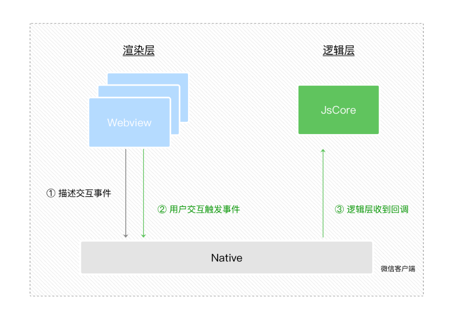
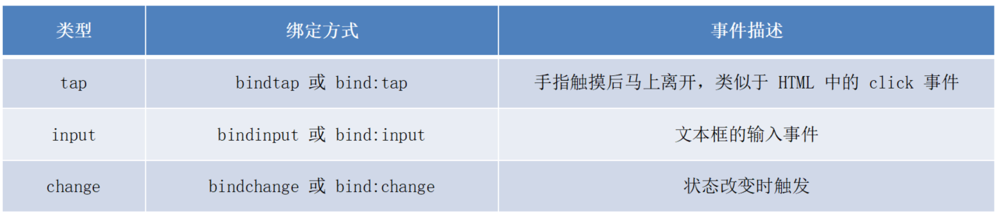
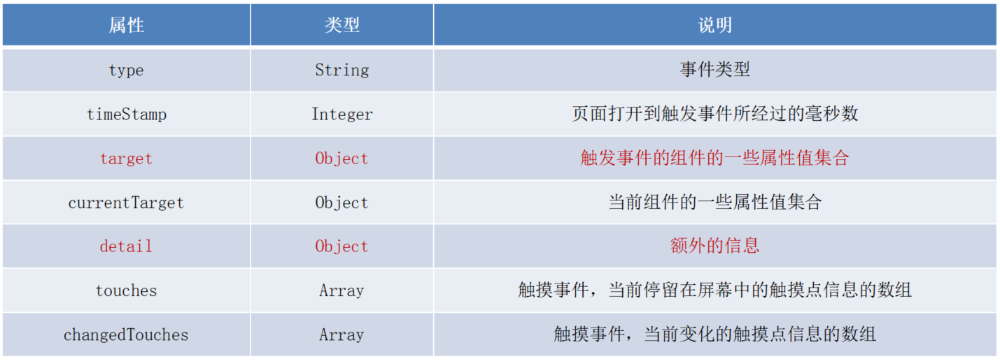
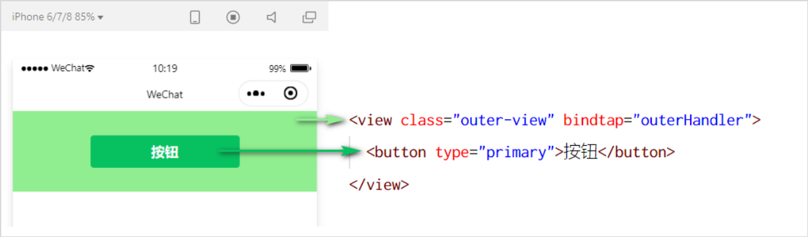
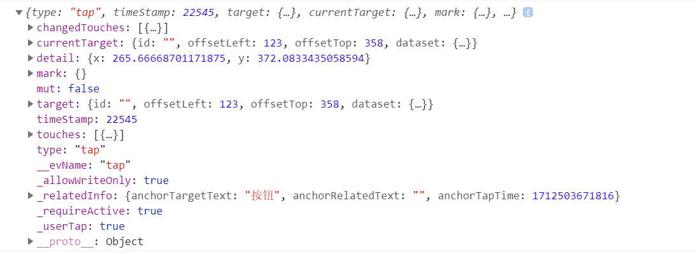

# 二. 模板与样式


# 1. WXML 模板语法

## 1.1. 数据绑定

- 在 data 中定义数据
- 在 WXML 中使用数据


**在 data 中定义页面的数据:**

在页面对应的 .js 文件中，把数据定义到 data 对象中即可：

```javascript
Page({
  data: {
    info: 'hello world',
    imgSrc: '/images/profile_pic.jpg',
    randNum1: Math.random() * 10,
    randNum2: Math.random().toFixed(2),
 })
```


**Mustache 语法的格式:**

把data中的数据绑定到页面中渲染，使用 Mustache 语法（双大括号）将变量包起来即可。语法格式为：

```html
<view>{{info}}</view>
<image src="{{imgSrc}}" mode="aspectFit"></image>
<view>{{randNum1 > 5? '>5' : '<=5'}}</view>
<view>{{randNum1 * 100}}</view>
```


以上对应 Mustache 的四种应用场景：

1. 绑定内容

2. 绑定属性

3. 三元运算

4. 算术运算

   

## 1.2. 事件绑定

### 1.2.1. 事件介绍

事件是渲染层到逻辑层的通讯方式。通过事件可以将用户在渲染层产生的行为，反馈到逻辑层进行业务的处理。



**小程序中常用的事件**




**事件对象的属性列表**

当事件回调触发的时候，会收到一个事件对象 event




**target 和 currentTarget 的区别**

target 是触发该事件的源头组件，而 currentTarget 则是当前事件所绑定的组件。举例如下：



点击内部的按钮时，点击事件以冒泡的方式向外扩散，也会触发外层 view 的 tap 事件处理函数。
此时，对于外层的 view 来说：

- e.target 指向的是触发事件的源头组件，因此，e.target 是内部的按钮组件
- e.currentTarget 指向的是当前正在触发事件的那个组件，因此，e.currentTarget 是当前的 view 组件


### 1.2.2. bindtap 的语法格式

通过 bindtap，可以为组件绑定 tap 触摸事件:

```html
<button type="primary" bindtap="btnTapHandler">按钮</button>
```

```javascript
Page({
  data: {
  },

  // 定义按钮的事件处理函数
  btnTapHandler(e) {
      console.log(e)
  },
```

console输出：




### 1.2.3. 为 data 中的数据赋值

通过调用 this.setData(dataObject) 方法，可以给页面 data 中的数据重新赋值，示例如下：

```javascript
  btnChangeCount () {
      this.setData({
          count: this.data.count + 1
      })
  },
```


### 1.2.4. 事件传参

可以为组件提供 data-* 自定义属性传参，其中 * 代表的是参数的名字：

- val_to_add会被解析为参数的名字
- 数值 2 会被解析为参数的值

```html
<button type="primary" bindtap="btnPassParameter" data-val_to_add="{{2}}">传参按钮</button>
```

通过 event.target.dataset.参数名 即可获取到具体参数的值：

```javascript
  btnPassParameter (e) {
    console.log('value to add:', e.target.dataset.val_to_add)
    this.setData({
        count: this.data.count + e.target.dataset.val_to_add
    })
    console.log('result:', this.data.count)
  },
```


### 1.2.5. bindinput 的语法格式

```html
<input bindinput="inputConsoleLog"></input>
```

通过 event.detail.value 即可获取到文本框最新值：

```javascript
  inputConsoleLog(e) {
    console.log(e.detail.value)
  },
```


### 1.2.6. 文本框数据同步

传入文本框默认值：

```html
<input value="{{inputMsg}}" bindinput="inputUpdateData"></input>
```

更新到data：

```javascript
  inputUpdateData(e) {
      this.setData({
          inputMsg: e.detail.value
      })
  },
```


# 2. WXSS 模板样式


```html

```

```javascript

```


```html

```

```javascript

```


# 3. 全局配置


# 4. 页面配置


# 5. 网络数据请求


# 6. 案例 - 本地生活（首页）

