# 二. 模板与样式 <!-- omit from toc -->

- [1. WXML 模板语法](#1-wxml-模板语法)
  - [1.1. 数据绑定](#11-数据绑定)
  - [1.2. 事件绑定](#12-事件绑定)
    - [1.2.1. 事件介绍](#121-事件介绍)
    - [1.2.2. bindtap 的语法格式](#122-bindtap-的语法格式)
    - [1.2.3. 为 data 中的数据赋值](#123-为-data-中的数据赋值)
    - [1.2.4. 事件传参](#124-事件传参)
    - [1.2.5. bindinput 的语法格式](#125-bindinput-的语法格式)
    - [1.2.6. 文本框数据同步](#126-文本框数据同步)
  - [1.3. 条件渲染](#13-条件渲染)
  - [1.4. 列表渲染](#14-列表渲染)
- [2. WXSS 模板样式](#2-wxss-模板样式)
  - [2.1. 介绍](#21-介绍)
  - [2.2. RPX 尺寸](#22-rpx-尺寸)
  - [2.3. 样式导入](#23-样式导入)
  - [2.4. 全局样式和局部样式](#24-全局样式和局部样式)
- [3. 页面配置](#3-页面配置)
  - [3.1. tabBar](#31-tabbar)
  - [3.2. window](#32-window)
- [4. 网络数据请求](#4-网络数据请求)
- [5. 案例 - 本地生活（首页）](#5-案例---本地生活首页)


# 1. WXML 模板语法

## 1.1. 数据绑定

- 在 data 中定义数据
- 在 WXML 中使用数据


**在 data 中定义页面的数据:**

在页面对应的 .js 文件中，把数据定义到 data 对象中即可：

```javascript
Page({
  data: {
    info: 'hello world',
    imgSrc: '/images/profile_pic.jpg',
    randNum1: Math.random() * 10,
    randNum2: Math.random().toFixed(2),
 })
```


**Mustache 语法的格式:**

把data中的数据绑定到页面中渲染，使用 Mustache 语法（双大括号）将变量包起来即可。语法格式为：

```html
<view>{{info}}</view>
<image src="{{imgSrc}}" mode="aspectFit"></image>
<view>{{randNum1 > 5? '>5' : '<=5'}}</view>
<view>{{randNum1 * 100}}</view>
```


以上对应 Mustache 的四种应用场景：

1. 绑定内容

2. 绑定属性

3. 三元运算

4. 算术运算

   

## 1.2. 事件绑定

### 1.2.1. 事件介绍

事件是渲染层到逻辑层的通讯方式。通过事件可以将用户在渲染层产生的行为，反馈到逻辑层进行业务的处理。


**小程序中常用的事件**


**事件对象的属性列表**

当事件回调触发的时候，会收到一个事件对象 event


**target 和 currentTarget 的区别**

target 是触发该事件的源头组件，而 currentTarget 则是当前事件所绑定的组件。举例如下：


点击内部的按钮时，点击事件以冒泡的方式向外扩散，也会触发外层 view 的 tap 事件处理函数。
此时，对于外层的 view 来说：

- e.target 指向的是触发事件的源头组件，因此，e.target 是内部的按钮组件
- e.currentTarget 指向的是当前正在触发事件的那个组件，因此，e.currentTarget 是当前的 view 组件


### 1.2.2. bindtap 的语法格式

通过 bindtap，可以为组件绑定 tap 触摸事件:

```html
<button type="primary" bindtap="btnTapHandler">按钮</button>
```

```javascript
Page({
  data: {
  },

  // 定义按钮的事件处理函数
  btnTapHandler(e) {
      console.log(e)
  },
```

console输出：


### 1.2.3. 为 data 中的数据赋值

通过调用 this.setData(dataObject) 方法，可以给页面 data 中的数据重新赋值，示例如下：

```javascript
  btnChangeCount () {
      this.setData({
          count: this.data.count + 1
      })
  },
```


### 1.2.4. 事件传参

可以为组件提供 data-* 自定义属性传参，其中 * 代表的是参数的名字：

- val_to_add会被解析为参数的名字
- 数值 2 会被解析为参数的值

```html
<button type="primary" bindtap="btnPassParameter" data-val_to_add="{{2}}">传参按钮</button>
```

通过 event.target.dataset.参数名 即可获取到具体参数的值：

```javascript
  btnPassParameter (e) {
    console.log('value to add:', e.target.dataset.val_to_add)
    this.setData({
        count: this.data.count + e.target.dataset.val_to_add
    })
    console.log('result:', this.data.count)
  },
```


### 1.2.5. bindinput 的语法格式

```html
<input bindinput="inputConsoleLog"></input>
```

通过 event.detail.value 即可获取到文本框最新值：

```javascript
  inputConsoleLog(e) {
    console.log(e.detail.value)
  },
```


### 1.2.6. 文本框数据同步

传入文本框默认值：

```html
<input value="{{inputMsg}}" bindinput="inputUpdateData"></input>
```

更新到data：

```javascript
  inputUpdateData(e) {
      this.setData({
          inputMsg: e.detail.value
      })
  },
```


## 1.3. 条件渲染

**wx:if**

```html
<button type="primary" bindtap="btnChangeType">切换type</button>
<view wx:if="{{type === 1}}">type=1</view>
<view wx:elif="{{type === 2}}">type=2</view>
<view wx:else>type=3</view>
```

```javascript
  btnChangeType() {
    var a = [1, 2, 3];
    this.setData({
        type: this.data.type = a[this.data.type % 3]
    })
  },
```

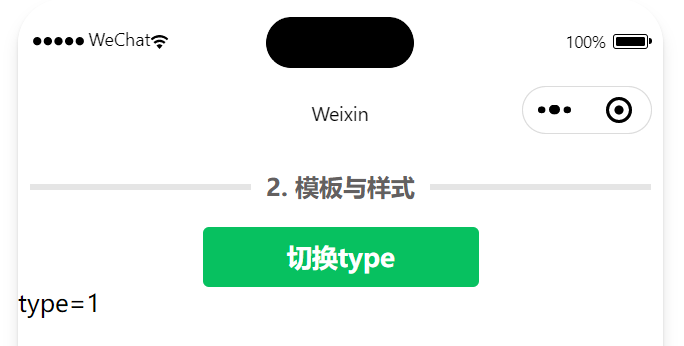


**结合 <block> 使用 wx:if**

- 如果要一次性控制多个组件的展示与隐藏，可以使用一个 <block></block> 标签将多个组件包装起来，并在<block> 标签上使用 wx:if 控制属性。
- 注意： <block> 并不是一个组件，它只是一个包裹性质的容器，不会在页面中做任何渲染。
- block 和 view 包裹的区别：

```html
<block wx:if="{{true}}">
    <view>view1 using block</view>
    <view>view2 using block</view>
</block>

<view wx:if="{{true}}">
    <view>view1 using view</view>
    <view>view2 using view</view>
</view>
```

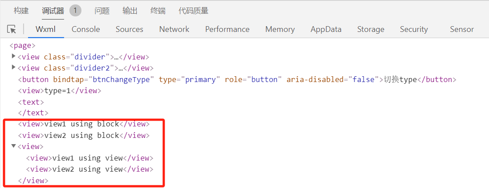


**hidden**

- 直接使用 hidden="{{ condition }}" 也能控制元素的显示与隐藏

- hidden 和 wx:if 的区别在于运行方式不同：

  - wx:if 以动态创建和移除元素的方式，控制元素的展示与隐藏

  - hidden 以切换样式的方式（display: none/block;），控制元素的显示与隐藏
  - 一个性能好，一个灵活。

- 使用建议

  - 频繁切换时，使用 hidden
  -  控制条件复杂时，使用 wx:if 搭配 wx:elif、wx:else 进行展示与隐藏的切换

```html
<view hidden="{{!flag}}">show by hidden</view>
<view wx:if="{{flag}}">show by wx:if</view>
```

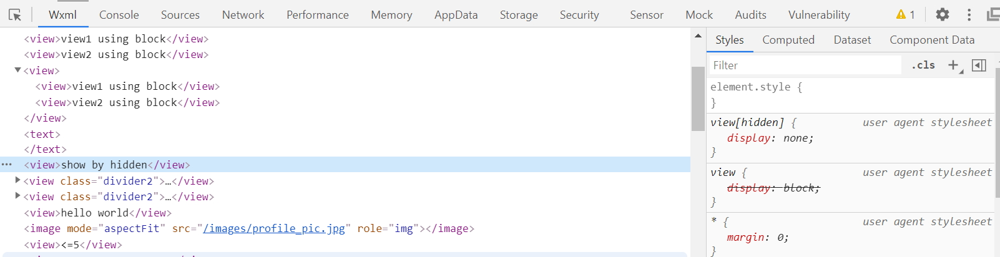

> 可以看到 hidden 是一直存在的，不需要重复创建。


## 1.4. 列表渲染

```javascript
data: {
    arr1: ['苹果', '华为', '小米'],
    userList: [
        {id: 1, name: 'name_a'},
        {id: 2, name: 'name_b'},
        {id: 3, name: 'name_c'},
    ],
  },
```


**wx:for**

通过 wx:for 可以根据指定的数组，循环渲染重复的组件结构:

```html
<view wx:for="{{arr1}}" wx:key="key">
    index: {{index}}, item: {{item}}
</view>
```

> 这里的 `wx:key="key"` 是为了不显示警告，貌似也可以提升效率，也就是用默认index当索引。


- 默认情况下，当前循环项的索引用 index 表示；当前循环项用 item 表示。
- 也可以使用 `wx:for-index` 和 `wx:for-item` 手动指定索引和当前项的变量名，在嵌套式方式变量名重复可以使用：

```html
<view wx:for="{{arr1}}" wx:for-index="idx" wx:for-item="itm" wx:key="key">

  index: {{idx}}, item: {{itm}}

</view>
```


**wx:key 的使用**

类似于 Vue 列表渲染中的 :key，小程序在实现列表渲染时，也建议为渲染出来的列表项指定唯一的 key 值，从而提高渲染的效率：

```html
<view wx:for="{{userList}}" wx:key="id">
    {{item.name}}
</view>
```


# 2. WXSS 模板样式

## 2.1. 介绍

- WXSS (WeiXin Style Sheets)是一套样式语言，用于美化 WXML 的组件样式，类似于网页开发中的 CSS。

- WXSS 具有 CSS 大部分特性，同时，WXSS 还对 CSS 进行了扩充以及修改，以适应微信小程序的开发。

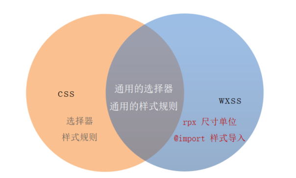


## 2.2. RPX 尺寸

- rpx（responsive pixel）是微信小程序独有的，用来解决屏适配的尺寸单位。
- rpx 的实现原理非常简单：鉴于不同设备屏幕的大小不同，为了实现屏幕的自动适配，rpx 把所有设备的屏幕，在宽度上等分为 750 份（即：当前屏幕的总宽度为 750rpx）。
- 小程序在不同设备上运行的时候，会自动把 rpx 的样式单位换算成对应的像素单位来渲染，从而实现屏幕适配。


在 iPhone6 上，屏幕宽度为375px，共有 750 个物理像素，等分为 750rpx。则：

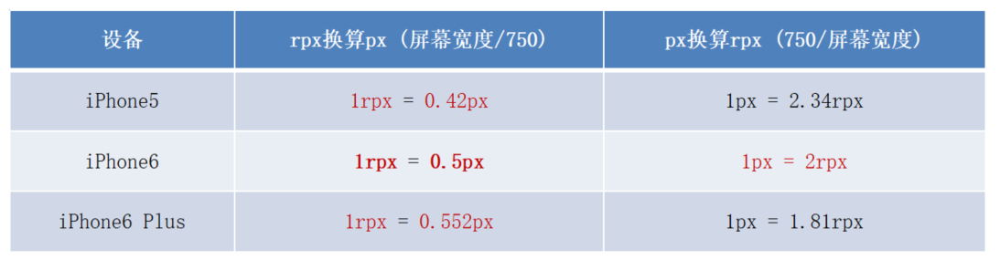


## 2.3. 样式导入

- 使用 WXSS 提供的 @import 语法，可以导入外联的样式表。

- @import 后跟需要导入的外联样式表的相对路径，用 ; 表示语句结束：

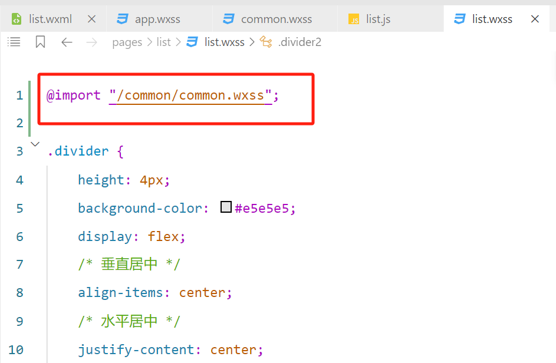

## 2.4. 全局样式和局部样式

- 定义在 app.wxss 中的样式为全局样式，作用于每一个页面。

- 在页面的 .wxss 文件中定义的样式为局部样式，只作用于当前页面。
  - 当局部样式和全局样式冲突时，根据就近原则，局部样式会覆盖全局样式
  - 当局部样式的权重大于或等于全局样式的权重时，才会覆盖全局的样式

比如：

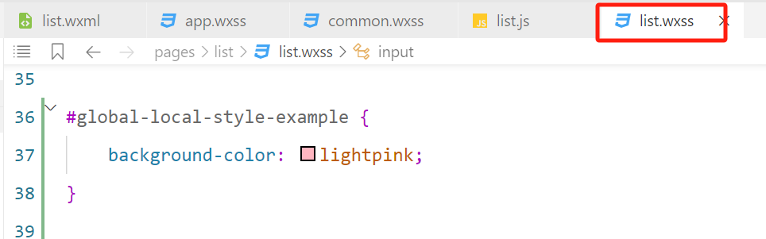


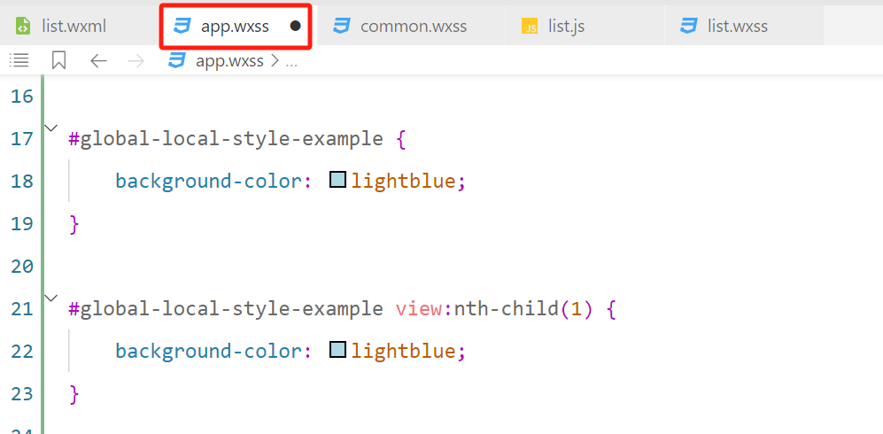


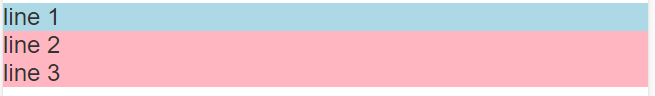

可以看到权重如下：

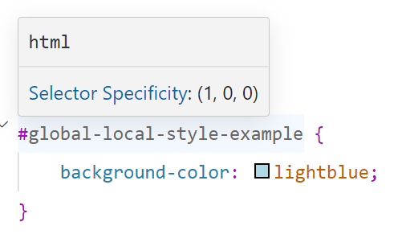

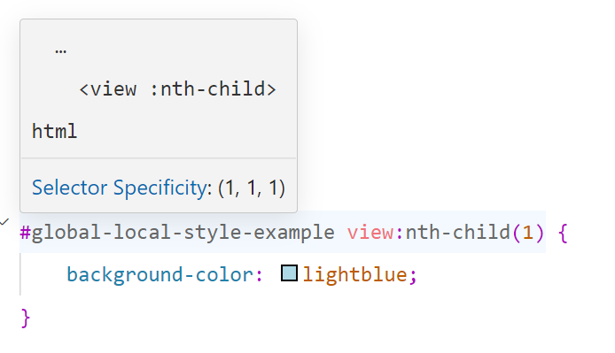

三个数字分别代表：`ID - CLASS - TYPE`


# 3. 页面配置

小程序根目录下的 app.json 文件是小程序的全局配置文件。常用的配置项如下：

- pages: 记录当前小程序所有页面的存放路径

- window: 全局设置小程序窗口的外观

- tabBar: 设置小程序底部的  tabBar 效果

- style: 是否启用新版的组件样式


## 3.1. tabBar

tabBar 是移动端应用常见的页面效果，用于实现多页面的快速切换。小程序中通常将其分为：

- 底部 tabBar

- 顶部 tabBar

  

> - tabBar中只能配置最少 2 个、最多 5 个 tab 页签
> - 当渲染顶部 tabBar 时，不显示 icon，只显示文本


**tabBar 的 6 个组成部分**

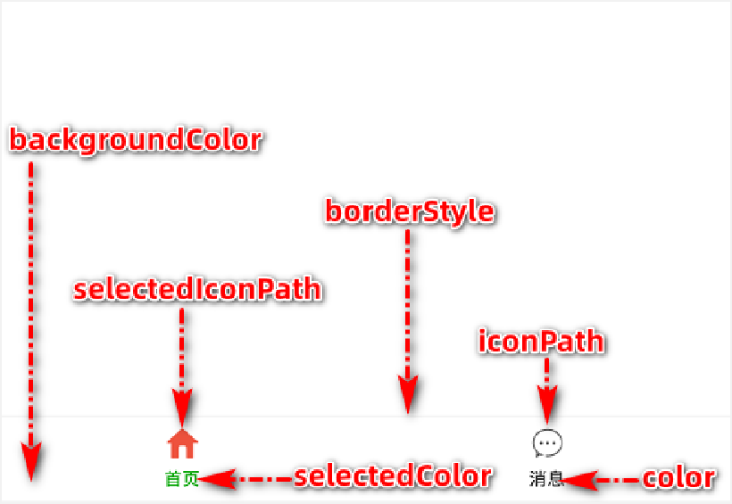


**tabBar 节点的配置项**

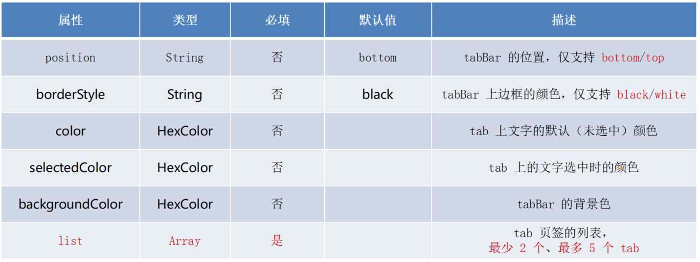


**每个 tab 项的配置选项**

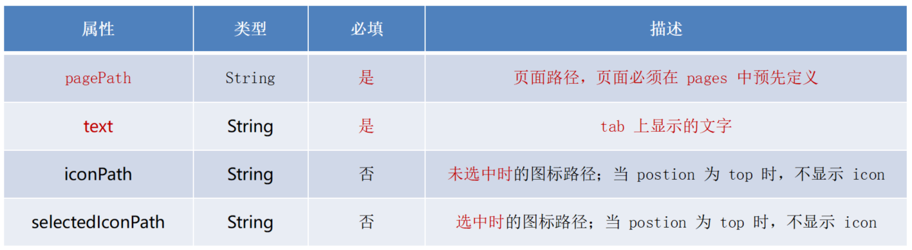


举例：

```json
"tabBar": {
    "list": [
    {
        "pagePath": "pages/list/list",
        "text": "list",
        "iconPath": "/images/tabs/home.png",
        "selectedIconPath": "/images/tabs/home-active.png"
    },
    {
        "pagePath": "pages/index/index",
        "text": "index",
        "iconPath": "/images/tabs/contact.png",
        "selectedIconPath": "/images/tabs/contact-active.png"
    },
    {
        "pagePath": "pages/logs/logs",
        "text": "logs",
        "iconPath": "/images/tabs/message.png",
        "selectedIconPath": "/images/tabs/message-active.png"
    }
    ]
},
```

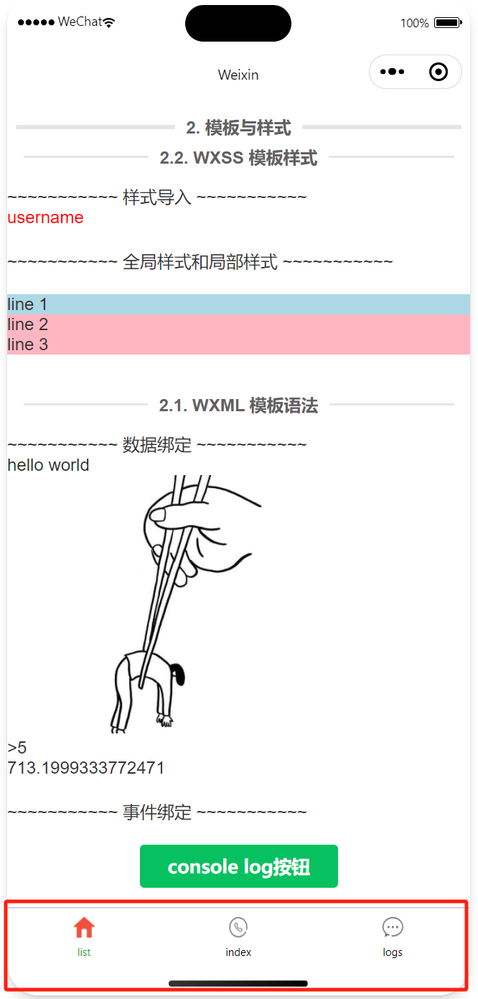


## 3.2. window

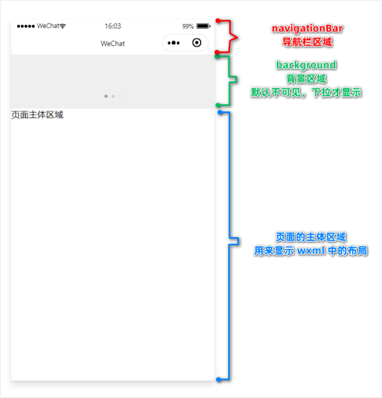

**window 节点常用的配置项**

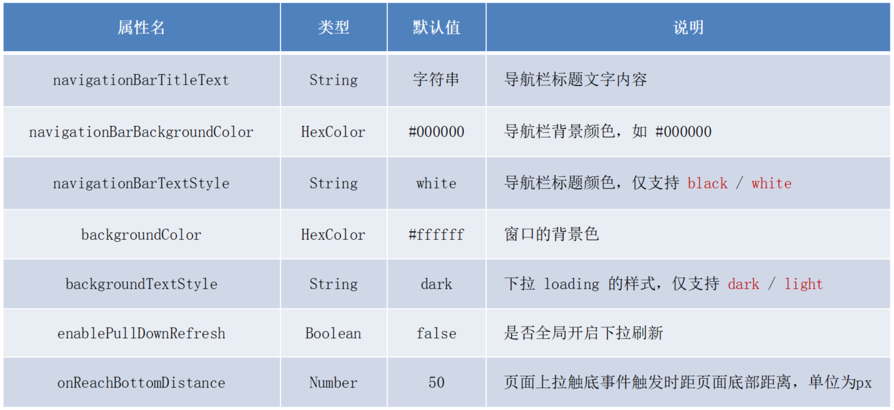

```json
  "window": {
    "navigationBarTextStyle": "black",
    "navigationBarTitleText": "Weixin",
    "navigationBarBackgroundColor": "#ffffff",
    "enablePullDownRefresh": true,
    "backgroundColor": "#efefef",
    "backgroundTextStyle": "dark",
    "onReachBottomDistance": 50
  },
```

> 如果要单独修改每个 tab 页面的 window，也可以直接去页面中的 json 文件修改。


# 4. 网络数据请求

出于安全性方面的考虑，小程序官方对数据接口的请求做出了如下两个限制：

- 只能请求 HTTPS 类型的接口
- 必须将接口的域名添加到信任列表中

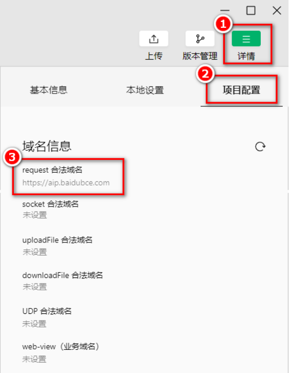


**配置 request 合法域名**

- 配置步骤：登录微信小程序管理后台 -> 开发 -> 开发设置 -> 服务器域名 -> 修改 request 合法域名

注意事项：

1. 域名只支持 https 协议
2. 域名不能使用 IP 地址或 localhost
3. 域名必须经过 ICP 备案
4. 服务器域名一个月内最多可申请 5 次修改


**GET**

```javascript
  btnApiGet() {
    wx.request({
        url: 'https://www.escook.cn/api/get',
        method: "GET",
        data: {
            name: "zs",
            age: 20,
        },
        success: (res) => {
            console.log(res.data)
        }
    })
  },
```


**POST**

```javascript
  btnApiPost() {
    wx.request({
        url: 'https://www.escook.cn/api/post',
        method: "POST",
        data: {
            name: "zs",
            age: 20,
        },
        success: (res) => {
            console.log(res.data)
        }
    })
  },
```


**在页面刚加载时请求数据**

```javascript
  onLoad(options) {
    this.btnApiGet()
  },
```


# 5. 案例 - 本地生活（首页）

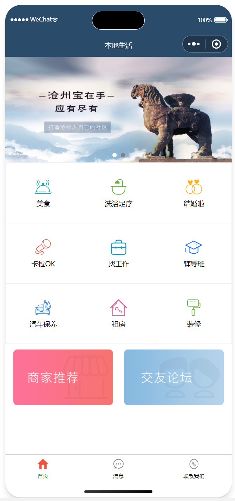


```html
<!-- 轮播图区域 -->
<swiper indicator-dots indicator-color="white" indicator-active-color="gray" circular>
    <swiper-item wx:for="{{swiperList}}" wx:key="key">
        <image src="{{item.image}}"></image>
    </swiper-item>
</swiper>

<!-- 九宫格 -->
<view class="grid-list">
    <view class="grid-item" wx:for="{{gridList}}" wx:key="key">
        <image src="{{item.icon}}"></image>
        <text>{{item.name}}</text>
    </view>
</view>

<!-- 图片 -->
<view class="img-box">
    <image src="/images/link-01.png" mode="widthFix"></image>
    <image src="/images/link-02.png" mode="widthFix"></image>
</view>
```


```css
swiper {
    height: 350rpx;
}

swiper image {
    width: 100%;
    height: 100%;
}

.grid-list {
    display: flex;
    flex-wrap: wrap;

    border-left: 1rpx solid #efefef;
    border-top: 1rpx solid #efefef;
    box-sizing: border-box;
}

.grid-item {
    width: 33.33%;
    height: 200rpx;
    display: flex;
    flex-direction: column;
    /* 副方向居中，前面设置了flex-direction: column，所以变成水平居中 */
    align-items: center;
    /* 主方向居中，前面设置了flex-direction: column，所以变成垂直居中 */
    justify-content: center;

    border-right: 1rpx solid #efefef;
    border-bottom: 1rpx solid #efefef;
    box-sizing: border-box;
}

.grid-item image {
    width: 60rpx;
    height: 60rpx;
}

.grid-item text {
    font-size: 24rpx;
    margin-top: 10rpx;
}

.img-box {
    display: flex;
    padding: 20rpx 10rpx;
    justify-content: space-around;
}

.img-box image {
    /* 配合上面的 space-around，实现两张图片之间的间距 */
    width: 45%;
}
```


