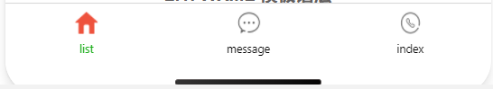
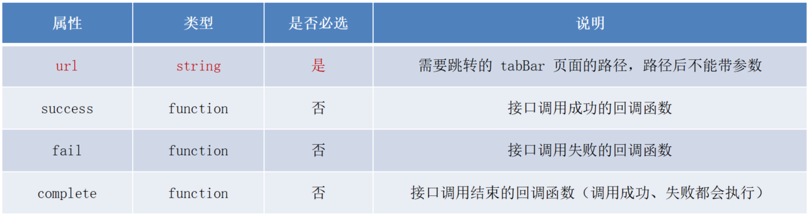
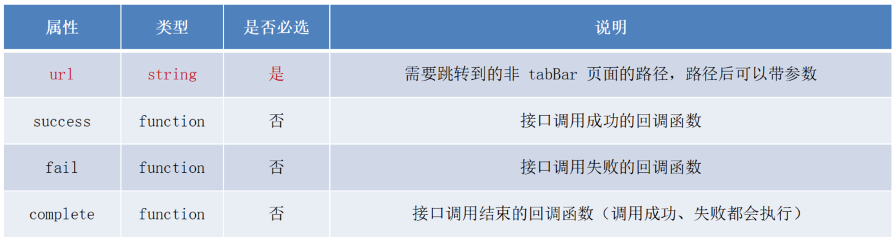
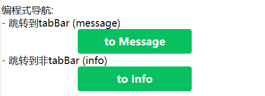
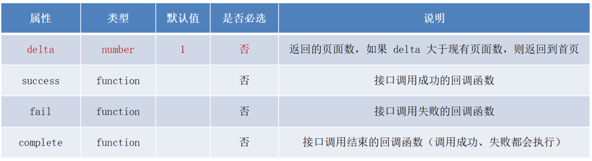
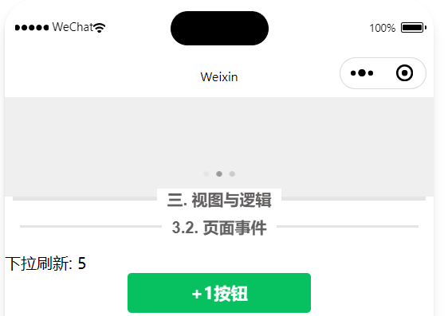
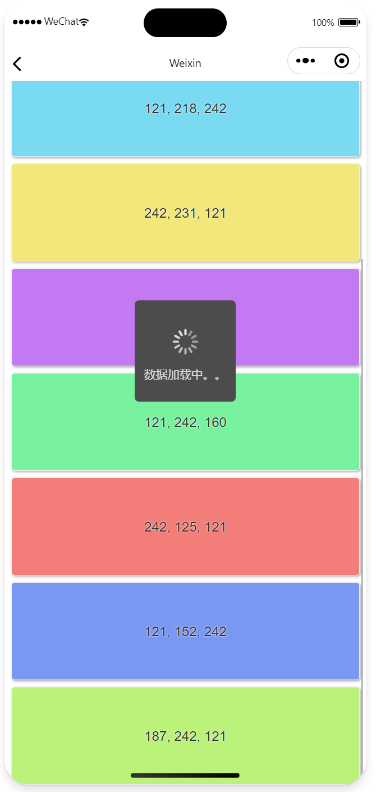
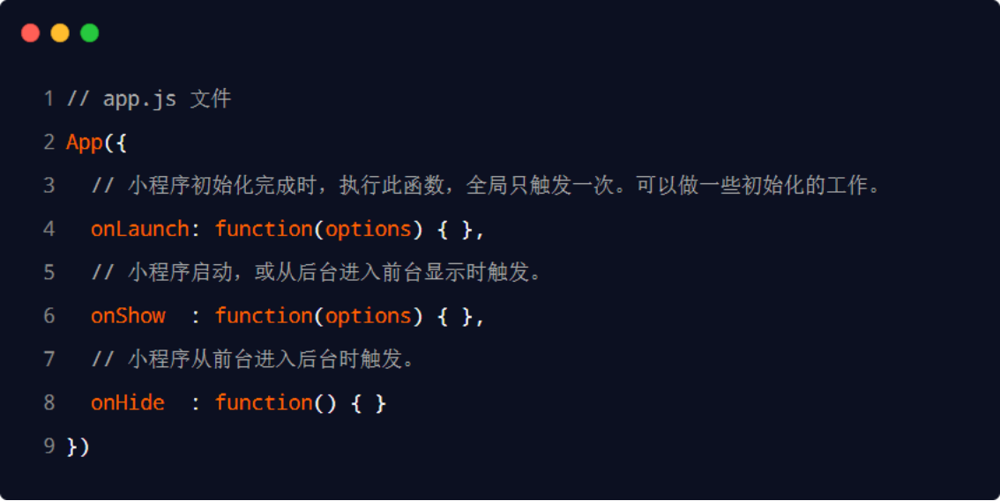
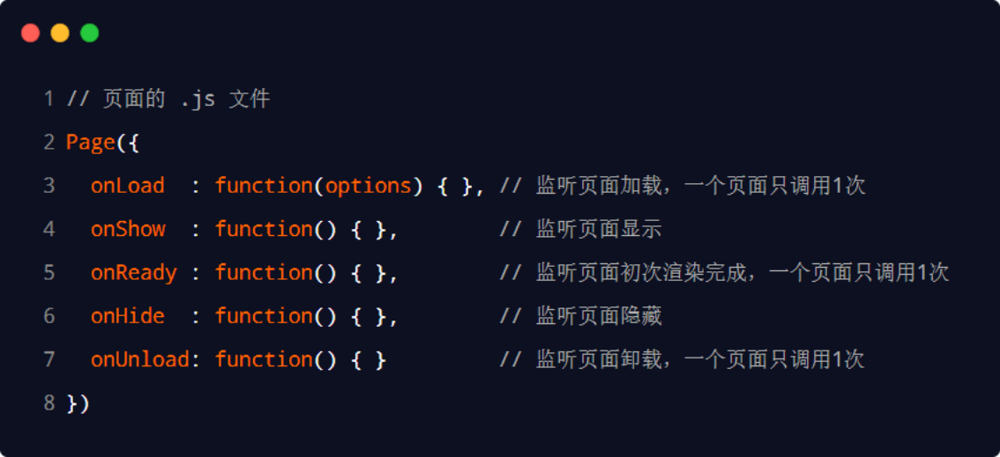

# 三. 视图与逻辑


# 1. 页面导航

页面导航指的是页面之间的相互跳转。例如，浏览器中实现页面导航的方式有如下两种：

1. <a> 链接

2. location.href


小程序中实现页面导航的两种方式：

1. 声明式导航
   - 在页面上声明一个 <navigator> 导航组件
   - 通过点击 <navigator> 组件实现页面跳转
2. 编程式导航
   - 调用小程序的导航 API，实现页面的跳转


导航到 tabBar 与非 tabBar 页面的函数略有不同，下文以 tabBar 中的 message 和非 tabBar 的 Info 举例。




## 1.1. 声明式导航

**导航到 tabBar 页面**，需要指定 url 属性和 open-type 属性，其中：

- url 表示要跳转的页面的地址，必须以 / 开头
- open-type 表示跳转的方式，必须为 switchTab


**导航到非 tabBar 页面**，需要指定 url 属性和 open-type 属性，其中：

- url 表示要跳转的页面的地址，必须以 / 开头
- open-type 表示跳转的方式，必须为 navigate


**示例：**

```html
<text>声明式导航:</text>
<!-- open-type="switchTab" 是必须的 -->
<navigator url="/pages/message/message" open-type="switchTab">- 跳转到tabBar (message)</navigator>
<!-- open-type="navigate" 不是必须的 -->
<navigator url="/pages/info/info" open-type="navigate">- 跳转到非tabBar (info)</navigator>
```


**后退导航**，则需要指定 open-type 属性和 delta 属性，其中：

- open-type 的值必须是 navigateBack，表示要进行后退导航
- delta 的值必须是数字，表示要后退的层级


```html
<navigator open-type="navigateBack" delta="1">后退</navigator>
```

> 好像只有非 tabBar 才能后退


## 1.2. 编程式导航


**导航到 tabBar 页面**，需要调用 wx.switchTab(Object object) 方法。其中 Object 参数对象的属性列表如下：




**导航到非 tabBar 页面**，需要调用 wx.navigateTo(Object object) 方法。其中 Object 参数对象的属性列表如下：




**示例：**



```html
<text>\n编程式导航:</text>
<text>\n- 跳转到tabBar (message)</text>
<button type="primary" bind:tap="btnGoToMessage">to Message</button>
<text>- 跳转到非tabBar (info)</text>
<button type="primary" bind:tap="btnGoToInfo">to Info</button>
```

```javascript
btnGoToMessage() {
    wx.switchTab({
        url: '/pages/message/message',
    })
},

btnGoToInfo() {
    wx.navigateTo({
        url: '/pages/info/info',
    })
},
```


**后退导航**，则需要调用 wx.navigateBack(Object object) 方法。其中 Object 参数对象可选的属性列表如下：



```html
<button type="primary" bind:tap="btnGoBack">后退</button>
```

```javascript
btnGoBack() {
    wx.navigateBack()
},
```


## 1.3. 导航传参

url 属性用来指定将要跳转到的页面的路径。同时，路径的后面还可以携带参数：

- 参数与路径之间使用 ? 分隔
- 参数键与参数值用 = 相连
- 不同参数用 & 分隔


声明式：

```html
<navigator url="/pages/info/info?name=zs&age=20" open-type="navigate"> 跳转到非tabBar (info)</navigator>
```

编程式：

```javascript
btnGoToInfo() {
    wx.navigateTo({
            url: '/pages/info/info?name=zs&age=20',
    })
},
```


**在 onLoad 中接收导航参数：**

传参所携带的参数，可以直接在 onLoad 事件中直接获取到，通常会把参数储存在 data 中：

```javascript
data: {
    query: {}  // 导航传递来的对象
},
onLoad(options) {
    console.log(options)
    this.setData({
        query: options
    })
},
```


# 2. 页面事件


## 2.1. 下拉刷新

```json
"window": {
    "enablePullDownRefresh": true,
    "backgroundColor": "#efefef",
    "backgroundTextStyle": "dark"
},
```


**事件：**

- 在页面的 .js 文件中，通过 onPullDownRefresh() 函数即可监听当前页面的下拉刷新事件。

- 当处理完下拉刷新后，下拉刷新的 loading 效果会一直显示，不会主动消失，所以需要手动隐藏下拉刷新的 loading 效果。此时，调用 wx.stopPullDownRefresh() 可以停止当前页面的下拉刷新。

- 例如，点击按钮可以 count 值自增 +1，刷新后归零：




```javascript
onPullDownRefresh() {
    console.log('下拉刷新')
    this.setData({
        count: 0
    })
    wx.stopPullDownRefresh()
},
```


## 2.2. 上拉触底

- 上拉触底是移动端的专有名词，通过手指在屏幕上的上拉滑动操作，从而加载更多数据的行为。

- 在页面的 .js 文件中，通过 onReachBottom() 函数即可监听当前页面的上拉触底事件。示例代码如下：

- 上拉触底距离指的是触发上拉触底事件时，滚动条距离页面底部的距离。可以在.json 配置文件中，通过 onReachBottomDistance 属性来配置上拉触底的距离，默认距离为 50px。


案例：

1. 定义获取随机颜色的方法
2. 在页面加载时获取初始数据
3. 渲染 UI 结构并美化页面效果
4. 在上拉触底时调用获取随机颜色的方法
5. 添加 loading 提示效果
6. 对上拉触底进行节流处理




```html
<!-- UI 结构 -->

<view wx:for="{{colorList}}" wx:key="index" class="colotList-item"
 style="background-color: rgba({{item}});">
    {{item}}
</view>
```


```css
/* 美化页面效果 */

.colotList-item {
    border: 1rpx solid #efefef;
    border-radius: 8rpx;
    line-height: 200rpx;
    margin: 15rpx;
    text-align: center;
    text-shadow: 0rpx 0rpx 5rpx #fff;
    box-shadow: 1rpx 1rpx 6rpx #aaa;
}
```


```javascript
    data: {
        colorList: [],
        isColorListLoading: false
    },

    getColors() {
        // 对上拉触底进行节流处理
        this.setData({
            isColorListLoading: true
        })

        // 添加 loading 提示效果
        wx.showLoading({
          title: '数据加载中。。。',
        })
		
        // 定义获取随机颜色的方法
        wx.request({
            url: 'https://applet-base-api-t.itheima.net/api/color',
            method: 'get',
            success: ({data: res}) => {
                this.setData({
                    colorList: [...this.data.colorList, ...res.data] // ... 用于转换成数组
                })
            },
            // 停止 loading 提示效果
            complete: () => {
                wx.hideLoading()
            }
        })

        // 对上拉触底进行节流处理
        this.setData({
            isColorListLoading: false
        })
    },
        
    // 在页面加载时获取初始数据
    onLoad(options) {
        this.getColors()
        this.getColors()
    },

    // 上拉刷新时重置
    onPullDownRefresh() {
        this.setData({
            colorList: []
        })
        this.onLoad()
        wx.stopPullDownRefresh()
    },
        
    // 在上拉触底时调用获取随机颜色的方法
    onReachBottom() {
        if (this.data.isColorListLoading) return  // 对上拉触底进行节流处理
        this.getColors()
    },
```


# 3. 生命周期

- 生命周期（Life Cycle）是指一个对象从创建 -> 运行 -> 销毁的整个阶段，强调的是一个时间段。

- 生命周期函数：是由小程序框架提供的内置函数，会伴随着生命周期，自动按次序执行。

- 生命周期函数的作用：允许程序员在特定的时间点，执行某些特定的操作。例如，页面刚加载的时候，可以在 onLoad 生命周期函数中初始化页面的数据。


小程序中的生命周期函数分为两类，分别是：

1. 应用的生命周期函数
   - 特指小程序从启动 -> 运行 -> 销毁期间依次调用的那些函数
2.  页面的生命周期函数
   - 特指小程序中，每个页面从加载 -> 渲染 -> 销毁期间依次调用的那些函数


## 3.1. 应用的生命周期函数

小程序的应用生命周期函数需要在 app.js 中进行声明，示例代码如下：




## 3.2. 页面的生命周期函数

小程序的页面生命周期函数需要在页面的 .js 文件中进行声明，示例代码如下：



> 注意区分 onLoad 和 onReady，如果要修改页面中的内容则必须等待渲染完成，也就是在 onReady 里用。


# 4. WXS 脚本

- WXS（WeiXin Script）是小程序独有的一套脚本语言，结合 WXML，可以构建出页面的结构。
- wxml 中无法调用在页面的 .js 中定义的函数，但是，wxml 中可以调用 wxs 中定义的函数。因此，小程序中 wxs 的典型应用场景就是“过滤器”。
- 虽然 wxs 的语法类似于 JavaScript，但是 wxs 和 JavaScript 是完全不同的两种语言
  - wxs 不能调用 js 中定义的函数
  - wxs 不能调用小程序提供的 API
- 在 iOS 设备上，小程序内的 WXS 会比 JavaScript 代码快 2 ~ 20 倍


## 4.1. 内嵌 WXS 脚本

- wxs 代码可以编写在 wxml 文件中的 <wxs> 标签内，就像 Javascript 代码可以编写在 html 文件中的 <script> 标签内一样。
- wxml 文件中的每个 <wxs></wxs> 标签，必须提供 module 属性，用来指定当前 wxs 的模块名称，方便在 wxml 中访问模块中的成员：

```html
<wxs module="m1">
    module.exports.toUpper = function(x) {
        return x.toUpperCase()
    }
</wxs>

<!-- 内嵌方法 -->
<view>{{username}}</view>
<view>{{m1.toUpper(username)}}</view>
```


## 4.2. 外联 WXS 脚本

wxs 代码还可以编写在以 .wxs 为后缀名的文件内，就像 javascript 代码可以编写在以 .js 为后缀名的文件中一样：


```javascript
function toLower(x) {
  return x.toLowerCase()
}

module.exports = {
  toLower: toLower
}
```

```html
<!-- 外联方法 -->
<wxs module="tools" src="../../utils/tools.wxs"></wxs>
<view>{{tools.toLower(username)}}</view>
```


# 5. 案例 - 本地生活（列表页面）


```html
html
```


```javascript
js
```


```css
css
```


```json
json
```

