# CSS Basis

- Cascading Stylesheets (层叠样式表)
- 告诉浏览器如何指定样式、布局等。

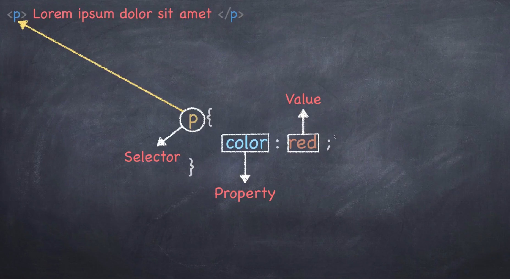

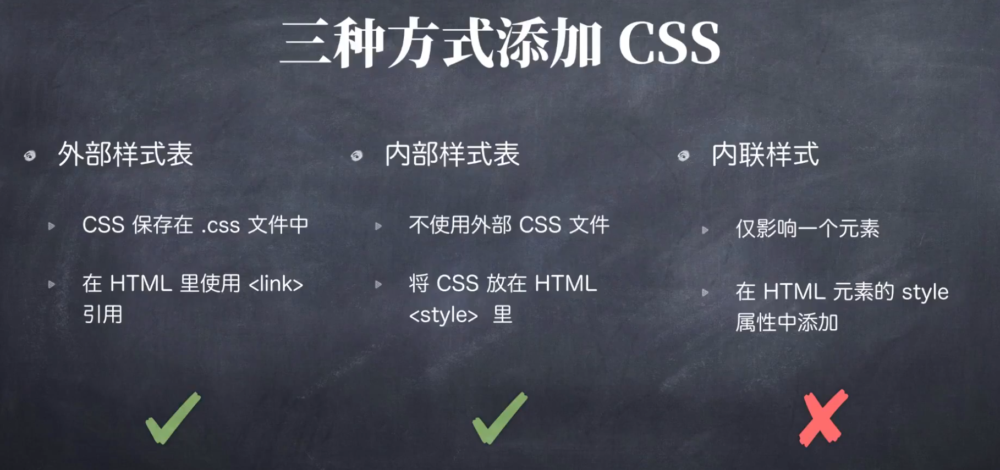

三种方法选择HTML标签：

- p是全局的p

- class可以是多个
- id一定要全局唯一

级别越小优先级越高。另外还有body，即整个页面。

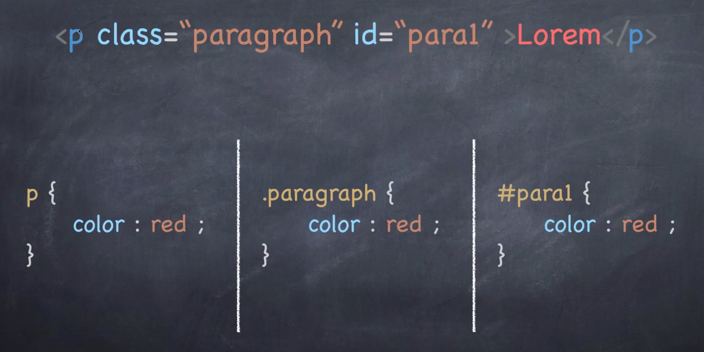

选择器及选择方式的网站：
https://developer.mozilla.org/en-US/docs/Learn/CSS/Introduction_to_CSS/Selectors

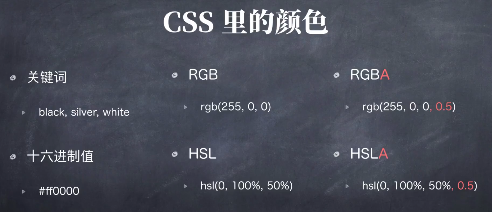

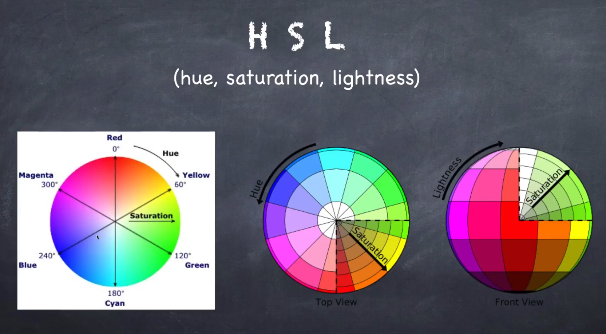

颜色取值网站：
https://developer.mozilla.org/en-US/docs/Web/CSS/color_value

HSL, RGB, 16进制颜色转换：
https://serennu.com/colour/hsltorgb.php

字体：

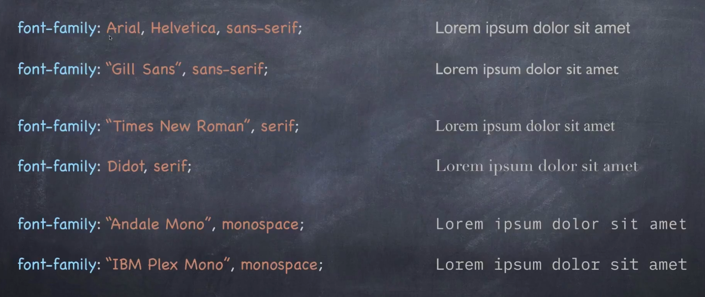

越前面的会被优先选择，找不到就会顺延；有空格的加引号。

各字体介绍：
https://developer.mozilla.org/en-US/docs/Learn/CSS/Styling_text/Fundamentals

不同系统自带字体占有率：
https://www.cssfontstack.com

免费字体选用平台：
https://fonts.google.com

盒子模型：

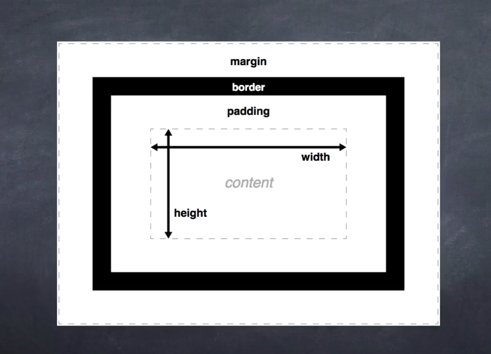

当多个盒子靠在一起时，不是：

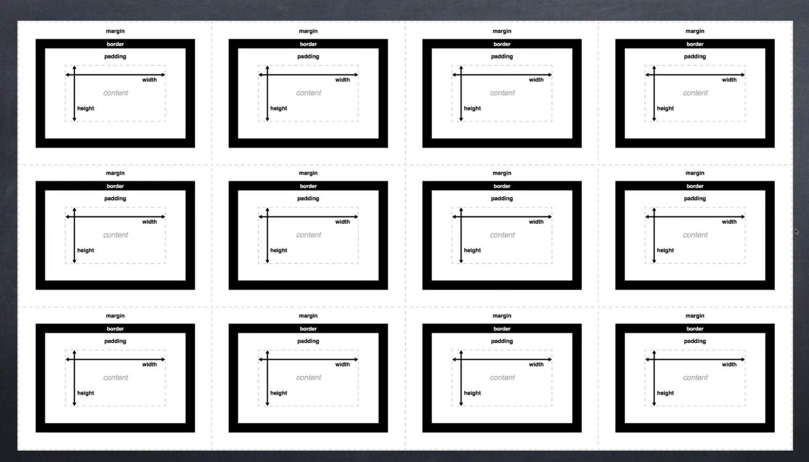

而是：

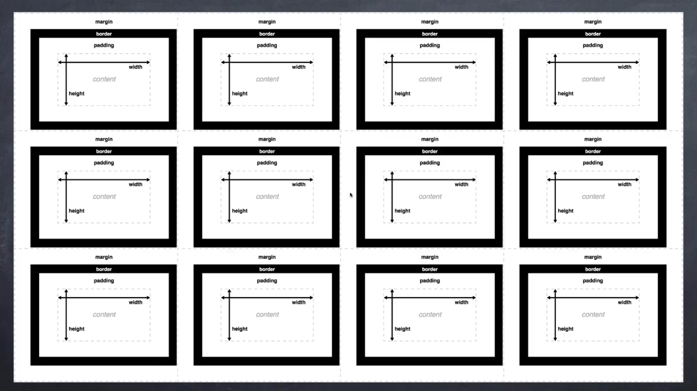

-> 外边距塌陷：只会取两个盒子之间最大的外边距

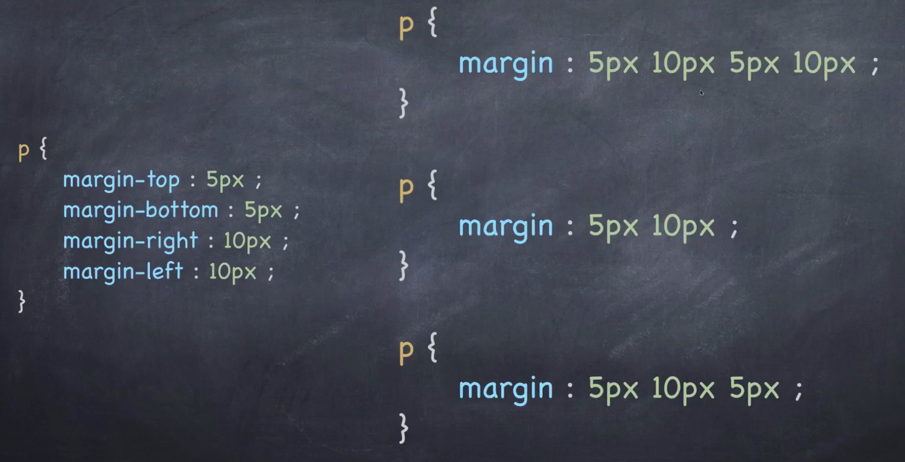

三种声明（padding同理）：

- 上、右、下、左（顺时针）

- 上下、左右
- 上、左右、下

或者四个都一样时指定一个就行。

定位方式：

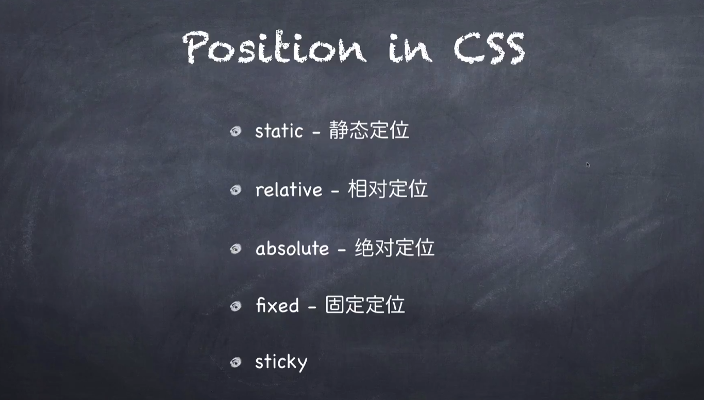

