# DOM Basis

- Document Object Model 文档对象模型


DOM 结构：

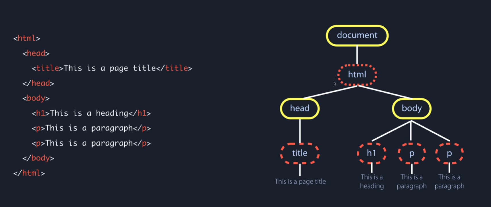


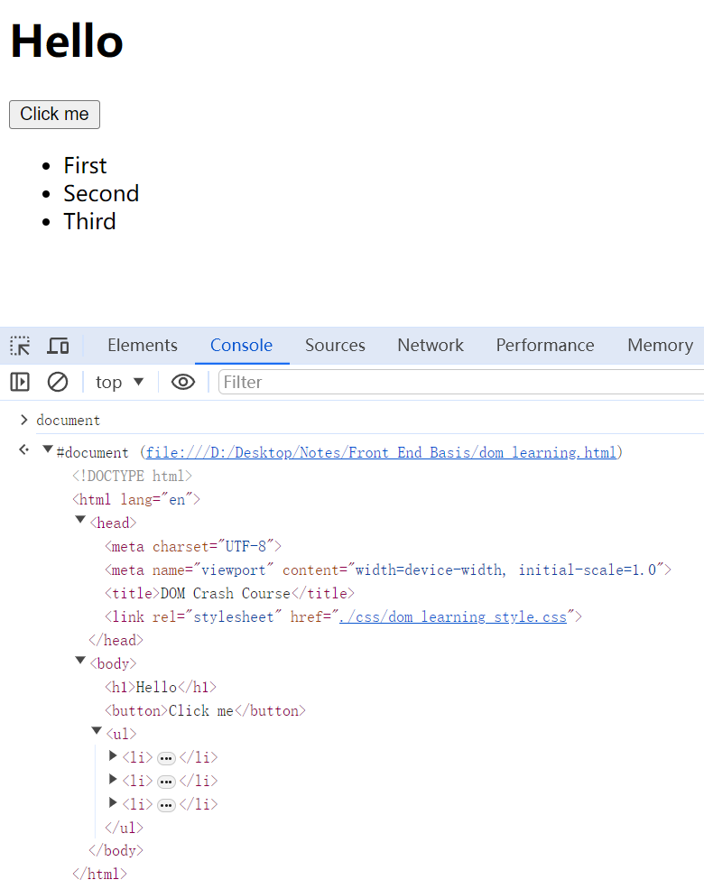


# 1. 选择 element

示例 HTML：

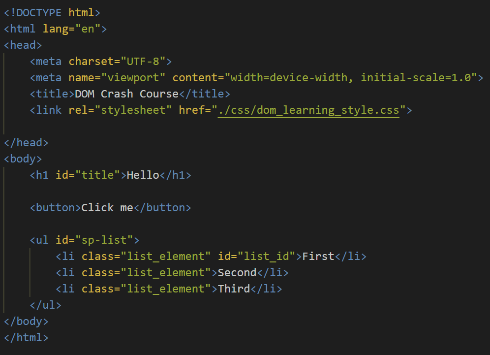

## .getElementsByTagName()

-> 返回一个collection

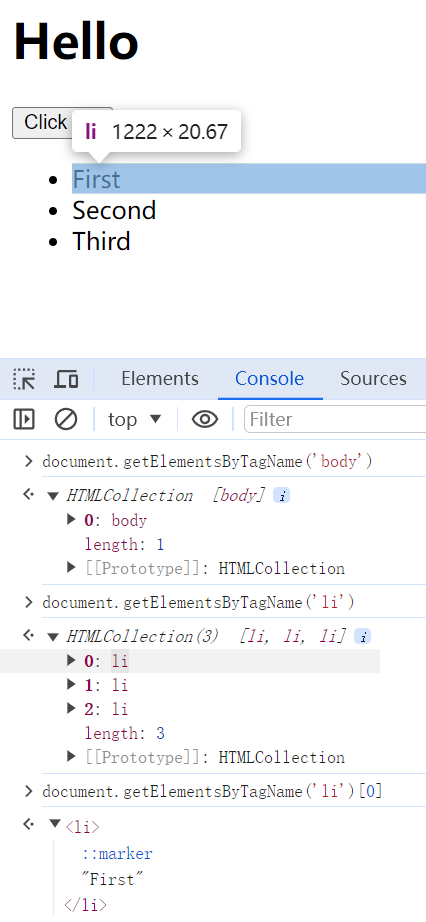

其他还有：

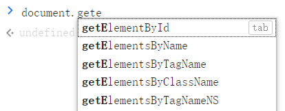

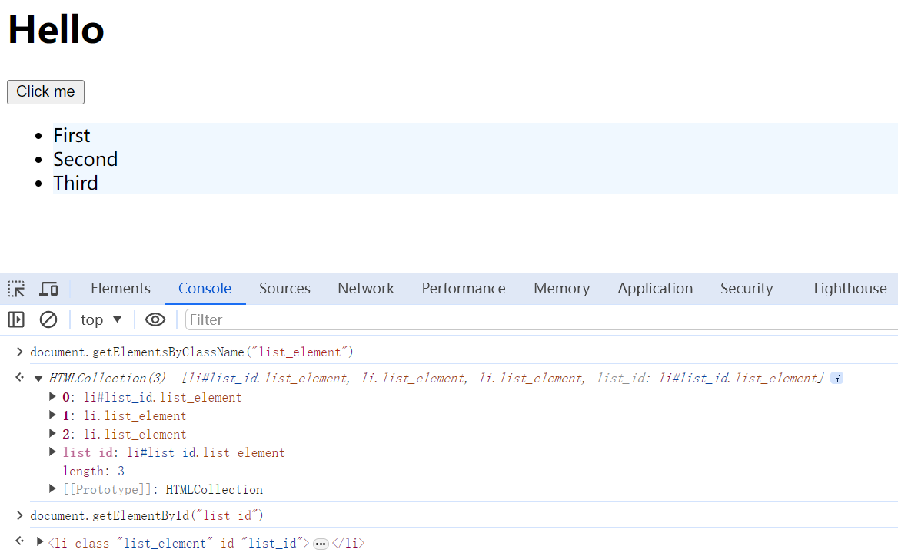


## .querySelector()

- 更方便且常用

- 默认值选择符合条件的第一个，不会返回collection
- 可同时作用于 tag, class, id，本质是CSS选择器的方法（. 或 # 的前缀）

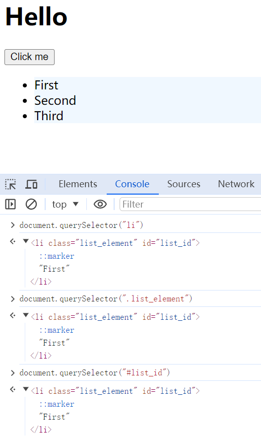

可以使用 querySelectorAll() 以返回多个：

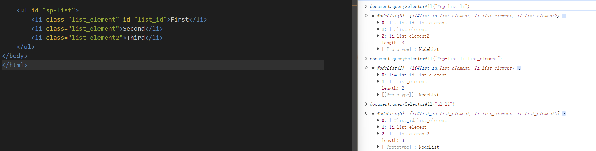


# 2. 修改 element

- CSS 只负责初始状态，JavaScript 负责交互；
- 所有 CSS style 都可以改；

- CSS 通常有dash，JavaScript 通常是驼峰命名法（background-color vs backgroundColor）。

Cheatsheet：

- https://www.w3schools.com/jsref/dom_obj_style.asp

## 2.1. 修改 CSS 内容

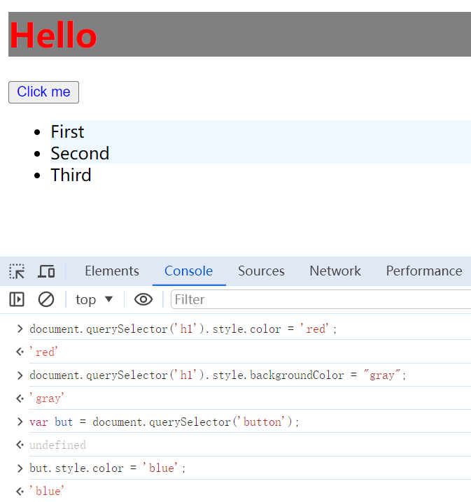


也可以在console里直接改，但仅是临时的：

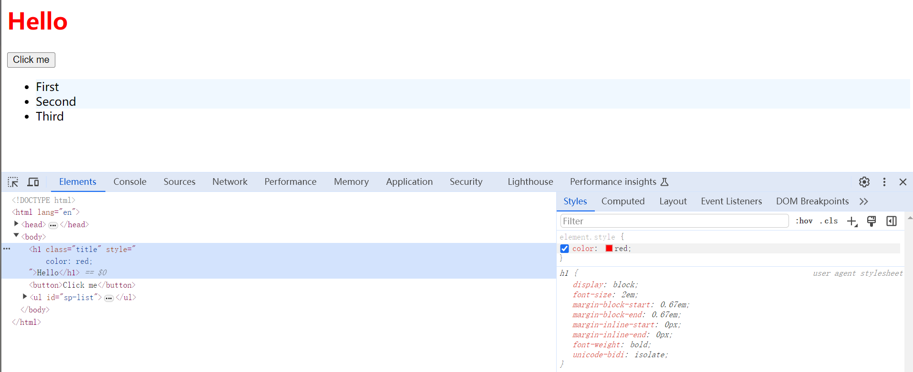


## 2.2. 修改文本内容

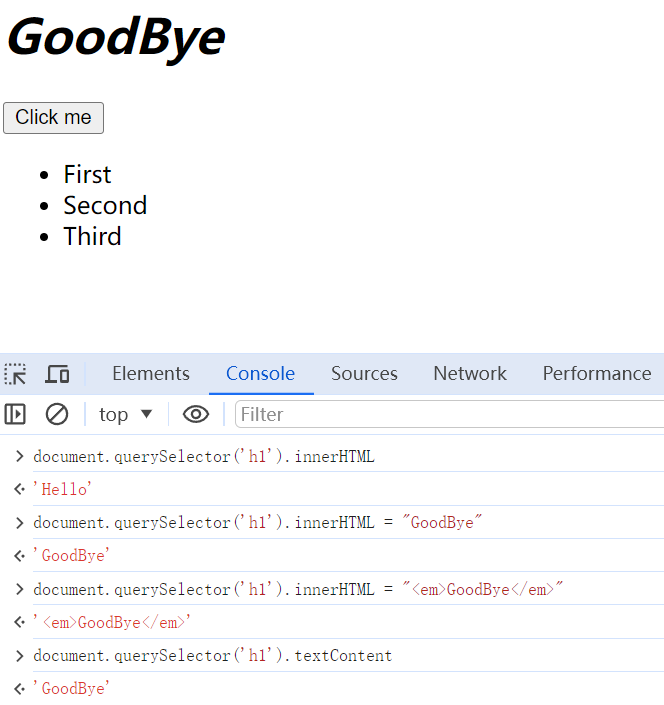


# 3. 添加、移除类

假设我们要对一个 element 操作，html中未赋予类名：

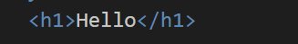

但CSS中却有对这个类的赋值：

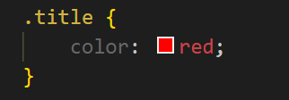

可以用 Js 实现添加类名，让这个heading变色，有以下不同的方法。


## 3.1. .classList.add()

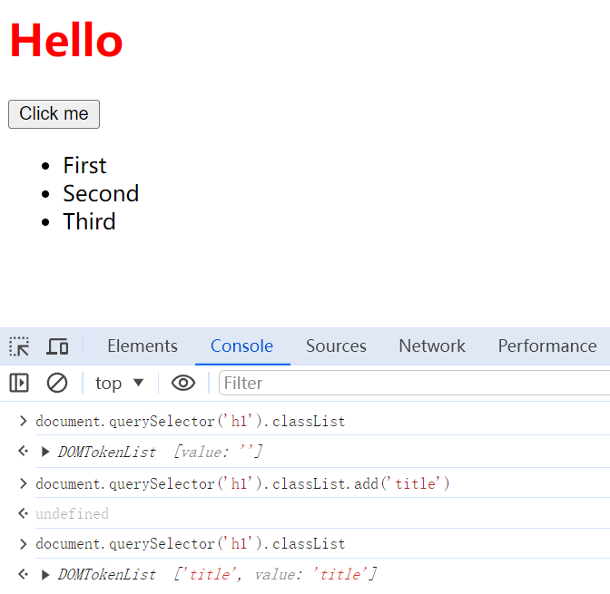

同时也可以用remove移除：

```javascript
document.querySelector('h1').classList.remove('title')
```


## 3.2. 修改 Attributes

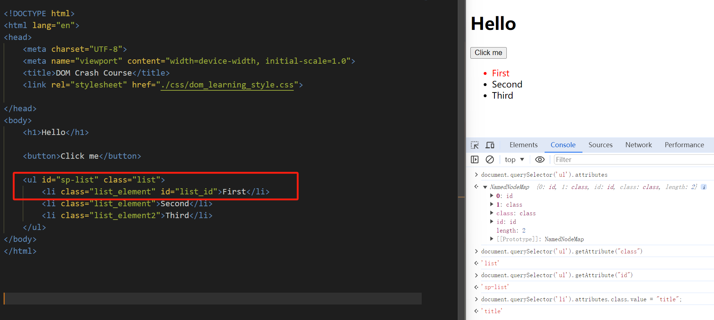


## 3.3. setAttributes()

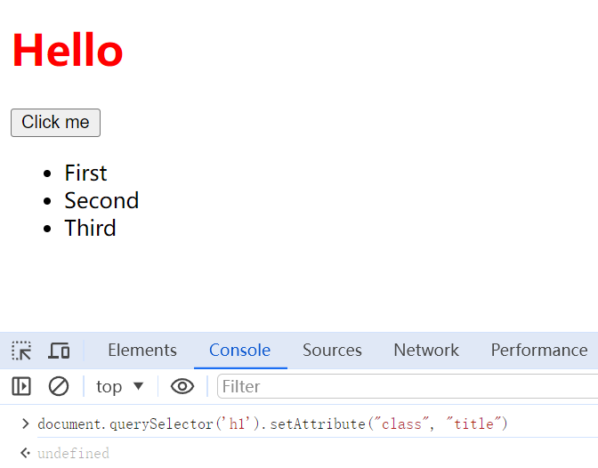


# 4. 事件交互

**.addEventListener(event_name, function)**

实现点击按钮让heading变色，借用了上一章最后的 title 类名。

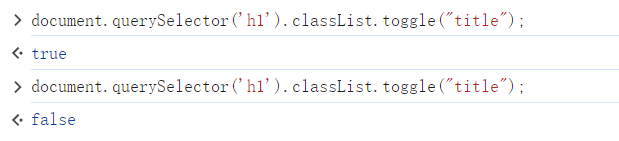

- toggle 可以切换 class 状态，上图就是先添加（heading变红）再移除（变黑）；
- 那么可以借助按钮点击的事件来执行toggle：

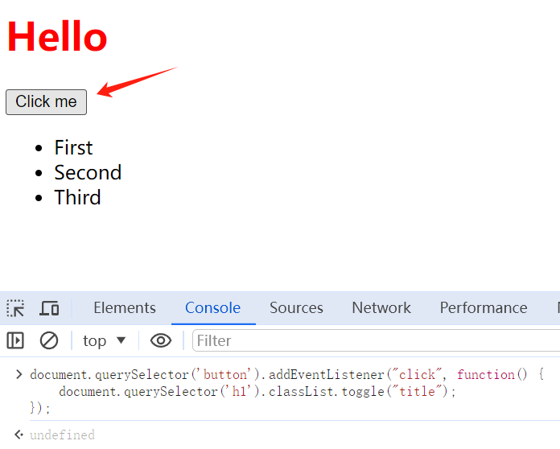


