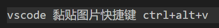

# HTML


# 1. Concepts

起始和结束标签：


常用tag：


基本文件组成：


元素类型: 


# 2. Basic  Tags

TAG 百科：https://developer.mozilla.org/en-US/docs/Web/HTML/Element


## 2.1. Paragraphs

if you type 'Lorem', 会生成占位符, 如果打Lorem10则会生成10个占位符

```html
<p>Lorem ipsum dolor sit amet .</p>
<p>if you type 'Lorem', 会生成占位符, 如果打Lorem10则会生成10个占位符</p>
```


## 2.2. Wording

**加粗 (<strong>): dutium**

*斜体Italics (<em>): asdfasdf*

```html
<p><strong> 加粗 (&lt;strong&gt;): dutium </strong></p>

<p><em>斜体Italics (&lt;em&gt;): asdfasdf</em></p>

```


## 2.3. hyperlink

[hyperlink, open in new tab(target="_blank)](https://www.baidu.com/)

```html
<p>
<a href="https://www.baidu.com/" target="_blank">hyperlink, open in new tab(target="_blank)</a>
</p>
```


## 2.4. List (ul)

- list 1 (li = list item)
- list 2
- list 31

```html
<ul>
<li>list 1 (li = list item)</li>
<li>list 2</li>
<li>list 31</li>
</ul>
```


## 2.5. List (ol)

1. list 1 (li = list item)
2. list 2
3. list 31

```
<ol>
<li>list 1 (li = list item)</li>
<li>list 2</li>
<li>list 31</li>
</ol>
```


## 2.6. Table

| name  | sex  | age  |
| ----- | ---- | ---- |
| fanyi | male | 18   |
| sdafa | dasf | asdf |
| uy    |      | dasf |

- th = table head
- tr = table row
- td = table data
- ugly as not rendered by css


```html
<table>
    <thead>
        <tr> 
            <th>name</th>
            <th>sex</th>
            <th>age</th>
        </tr>
    </thead>

    <tbody>
            <td>fanyi</td>
            <td>male</td>
            <td>18</td>
    </tbody>

    <tbody>
            <td>sdafa</td>
            <td>dasf</td>
            <td>asdf</td>
    </tbody>

    <tbody>
            <td>uy</td>
            <td></td>
            <td>dasf</td>
    </tbody>
</table>
```


## 2.7. Formatting

br /: change line


hr: horizontal line

------

用div style加指定px的margin:

<div style="margin-top:100px"></div>

```html
<p>br /: change line</p>
<br />
<p>hr: horizontal line</p>
<hr>
<p>用div style加指定px的margin: </p>
<div style="margin-top:100px"></div>
```


### 2.8. Form 表单


- div = division 区块
- 填完之后会提交给网站后端的服务器, 通过 'name' 传递给后端服务器
- action = "form.js", 提交后会用from.js 程序处理
- method = post/get, post比较安全, get的话所有信息都会显示在url里
- type = email 会自动验证邮箱格式


```html
<form action="form.js" method="POST">
    <div>
        <label>First Name: </label>
        <input type="text" name="firstname" placeholder="Enter First Name">
    </div>
    <div>
        <label>Last Name: </label>
        <input type="text" name="lastname" placeholder="Enter Last Name">
    </div>
    <div>
        <label>Email: </label>
        <input type="email" name="email" placeholder="Enter Email">
    </div>
    <input type="submit" name="submit" value="Submit!">
</form>
```


### 2.9. Button按钮


```html
<button> This is a button </button>
<br>
<button> This is another button</button>
```


### 2.10. Image

style="width: 70vw" -> 70% 浏览器宽度




```html
        <p>style="width: 70vw" -> 70% 浏览器宽度</p>
        
```


### 2.11. Abbreviation, Quotation and Citation

Abbreviation:

IC is a prestigious college

Quotation:

> Lorem ipsum dolor sit amet consectetur adipisicing elit. Natus, aliquid!

Cite:

IC is a prestigious college by Fanyi Sun

```html
<p>Abbreviation: </p>
<p><abbr title="Imperial college London">IC</abbr> is a prestigious college</p>

<p>    Quotation: </p>
<blockquote>Lorem ipsum dolor sit amet consectetur adipisicing elit. Natus, aliquid!</blockquote>

<p>    Cite: </p>
<p><cite><abbr title="Imperial college London">IC</abbr> is a prestigious college </cite> by Fanyi Sun</p>
```

