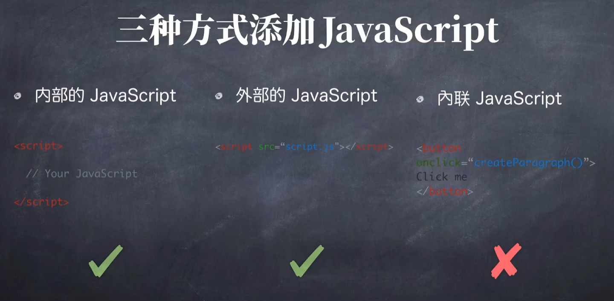
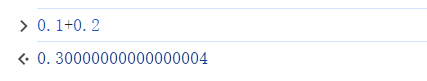

# JavaScript Basis

## Concepts

- 可以在网页上实现复杂的功能、交互

- 解释型语言

- 运行在**客户端**

- 面向对象语言

  




不区分integer和float，统一float64：




## Syntax

### String

```js
alert("Welcome to javascript crash course!");

 // print到开发者模式的console: 
console.log("length of hello: " + "hello".length);
console.log("2th letter of hello: " + "hello".charAt(1));  // e
console.log("replace 'l' with 'j': " + "hello".replace('l', 'j'));  // hejlo
console.log("capitalize: " + "hello".toUpperCase());
console.log("3 + 4 + '5' =", (3+4+"5"));  // 75
```


### Variables

```js
// 定义变量:
var a1 = "##";
let a2 = "##";
// 重新赋值:
a1 = "new_name"
// 数值
var val = 1;
val += 5
val++
// 常量(不可更改):
const pi = 3.14;

// var 和 let 的区别
// var 没有作用域, 可以在任何地方访问. let 和 const都有作用域
if (true) {
    let age = 20;
}
// console.log(age);  // 会报错, age只在if里能被访问到
```


### If

```js
// If
var a="a";
if (a == "a") {
    console.log(1)
} else if (a == "b") {
    console.log(2)
} else {
    console.log(3)
};

var age = 20;
var allowed = (age >= 18) ? "Yes" : "No";

// 两个等号会类型自动转换
console.log(123 == '123');  // true
console.log(123 === '123');  // false

```


### Loop

```js
for (let i = 0; i < 5; i++) {
    console.log(i)
}

console.log('\n');
var i = 1;
while (i < 3) {
    console.log(i);
    i ++;
};

var j = 1;
do {  // do...while 至少会保证代码运行一次
    console.log(j)
    j++;
} while (j < 3)
```


### Switch

```js
var name_ = "Simon";
switch(name_) {
    case "Simon":
        console.log("Simon")
        break  
    case "John":
        console.log("John")
        break
    default: // else
        console.log("Stranger")
}  // -> Simon

// break起到跳出作用, 否则会向下继续检查, 所以不单纯是if...elif...else:
switch(name_) {
    case "Simon":
        console.log("Simon")
    case name_.length == 5:
        console.log("length 5")
    default: // else
        console.log("Stranger")
}  // -> Simon \n length 5 \n Stranger
```


### Object

```js
// 两种方法:
var obj = new Object();
var obj2 = {};

obj = {
    name_: "Simon",
    age: 20,
    contact: {
        email: "simon@gmail.com",
        phone: "1234567",
        telegram: "@Simon",
    },
}

console.log(obj.contact.email); // or obj["name"]
obj.name = 21;
```


### Array

https://developer.mozilla.org/en-US/docs/Web/JavaScript/Reference/Global_Objects/Array

```js
// 两种方法:
var a = new Array();
var b = [];

a[0] = "dog";
a[3] = "tiger";
console.log(a);  // ['dog', empty × 2, 'tiger']
console.log(a[2]);  // undefined
console.log(a.length);  // 4

for (let i in a) {
    console.log(a[i]);
};  // dog \n tiger

for (let i=0; i < a.length; i++) {
    console.log(a[i]);
};  // dog \n 2 undefined \n tiger

b = [100, 200, 300, 400];
// basic operations:
b.push(1000); // append at last
b.pop(); // remove last
b.unshift(0); // append at first
b.shift(); // remove first
b.reverse();
```


### Function

```js
function add(x) {
    c += x
}

let c = 5;
add(1);
console.log(c);

// 传入任意长度:
function add() {
    let sum = 0;

    for (let i = 0; i < arguments.length; i++) {
        sum  += arguments[i];
    }
    return sum
}

console.log(add(1, 2, 3, 4, 5, 6));
```


### Closure (闭包)

```js
// 返回一个函数
function makeAdder(a) {
    return function(b) {
        return a+b;
    }
}

var x = makeAdder(1)
console.log(x(10));

```

